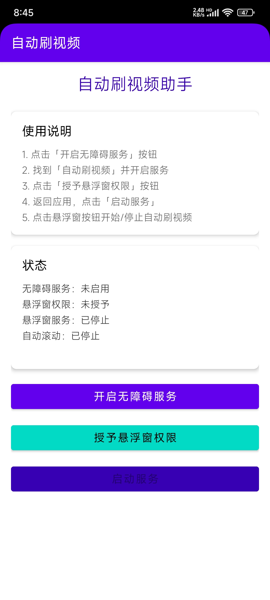
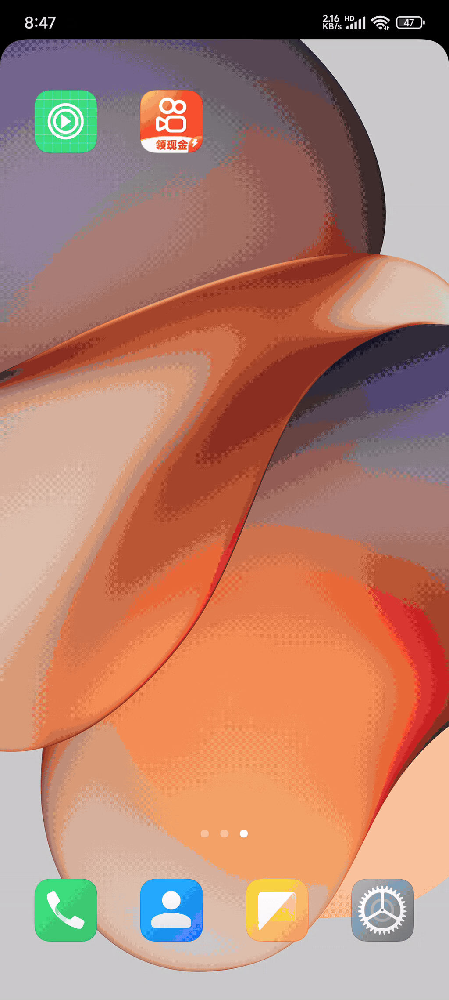

# 自动刷视频 APP

## 功能特点

1. **自动滑动**：使用无障碍服务模拟人类滑动操作
2. **随机间隔**：可在 3-8 秒之间随机滑动间隔（可自定义）
3. **随机位置**：每次滑动的位置都有随机偏移，更拟人化
4. **悬浮窗控制**：点击悬浮球即可开始/停止自动刷视频
5. **支持应用**：抖音、快手、TikTok 等所有短视频应用

## APP截图



## APP操作视频

操作视频网盘下载地址：[自动刷视频](https://www.guangyapan.com/s/1905450688040321110_aerIxeS_zVounKdp#/share "自动刷视频")




## 使用步骤

### 1. 编译和安装

```bash
# 使用 Android Studio 打开项目
# 或者使用命令行编译
./gradlew assembleDebug

# APK 文件位置：app/build/outputs/apk/debug/app-debug.apk
```

APK安装包网盘下载地址：[自动刷视频](https://www.guangyapan.com/s/1905445185801343001_aerIxeS_zVounKdp#/share "自动刷视频")

APK安装包：[自动刷视频](https://github.com/qqbn2027/autoscroll/releases "自动刷视频")

将生成或下载的 APK 安装到手机上，即可使用。

### 2. 权限配置

打开应用后，需要授予以下权限：

1. **无障碍服务权限**
   - 点击"开启无障碍服务"按钮
   - 在系统设置中找到"自动刷视频"
   - 开启服务开关

2. **悬浮窗权限**
   - 点击"授予悬浮窗权限"按钮
   - 在系统设置中允许应用显示在其他应用上层

### 3. 开始使用

1. 点击"启动服务"按钮
2. 屏幕上会出现一个悬浮球（播放图标）
3. 打开抖音或其他短视频应用
4. 点击悬浮球开始自动刷视频（图标变为暂停）
5. 再次点击悬浮球停止

## 高级设置

### 修改滑动间隔

在 `AutoScrollAccessibilityService.kt` 中修改：

```kotlin
var minIntervalSeconds = 3  // 最小间隔（秒）
var maxIntervalSeconds = 8  // 最大间隔（秒）
```

### 自定义滑动距离

在 `performGestureOnNode` 方法中调整滑动路径的起点和终点。

## 注意事项

1. **电量消耗**：长时间使用会增加电量消耗
2. **网络使用**：自动刷视频会消耗流量
3. **应用兼容性**：某些应用可能有防自动化机制
4. **合理使用**：请适度使用，避免过度依赖

## 技术原理

### 无障碍服务 (AccessibilityService)

- 监听窗口内容变化
- 识别可滚动视图（RecyclerView、ListView 等）
- 使用 `dispatchGesture()` 执行滑动手势

### 悬浮窗服务 (FloatingWindowService)

- 使用 `TYPE_APPLICATION_OVERLAY` 创建悬浮窗
- 支持拖拽移动
- 点击切换状态

### 拟人化设计

- 随机时间间隔：避免固定频率
- 随机滑动位置：水平方向随机偏移
- 随机滑动距离：起点和终点都有微小变化

## 项目结构

```
app/
├── src/main/
│   ├── java/com/autoscroll/app/
│   │   ├── MainActivity.kt              # 主界面
│   │   └── service/
│   │       ├── AutoScrollAccessibilityService.kt  # 无障碍服务
│   │       └── FloatingWindowService.kt           # 悬浮窗服务
│   ├── res/
│   │   ├── layout/
│   │   │   ├── activity_main.xml        # 主界面布局
│   │   │   └── floating_window.xml      # 悬浮窗布局
│   │   ├── drawable/                    # 图标和背景
│   │   ├── values/                      # 字符串、颜色、样式
│   │   └── xml/
│   │       └── accessibility_service_config.xml  # 无障碍服务配置
│   └── AndroidManifest.xml              # 应用配置
└── build.gradle                          # 构建配置
```

## 常见问题

**Q: 悬浮窗不显示？**
A: 检查是否授予了悬浮窗权限，部分手机需要在应用管理中手动开启。

**Q: 滑动不生效？**
A: 确保无障碍服务已启用，某些手机（如小米、华为）需要在开发者选项中开启"模拟点击"。

**Q: 某些应用无法使用？**
A: 部分应用有防自动化机制，可以尝试在应用启动后再开启服务。

## 开发环境

- Android Studio Arctic Fox 或更高版本
- Gradle 8.0
- Kotlin 1.9.0
- 最低 Android 版本：7.0 (API 24)

## 许可证

本项目仅供学习和个人使用。
